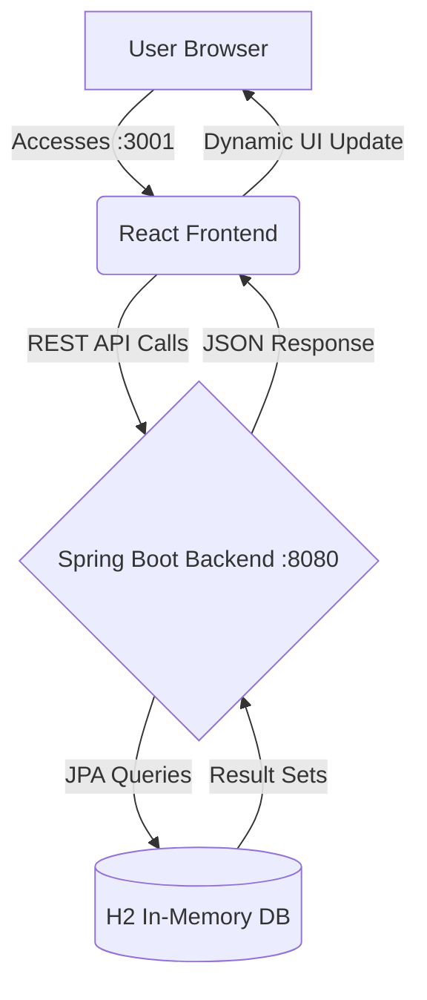
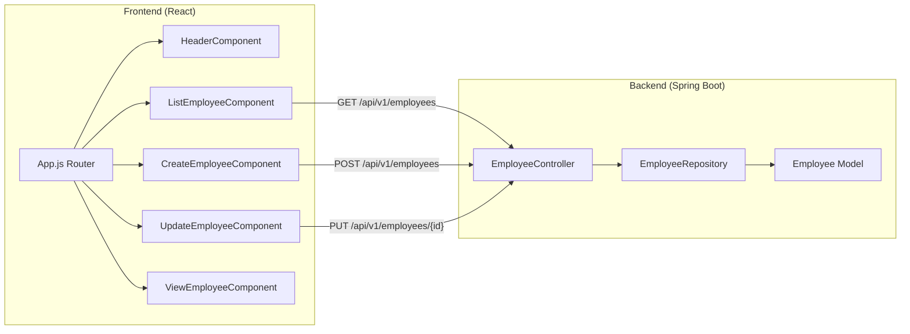

# 🚀 Advanced Employee Management System

A premium Full-Stack application built with **Spring Boot** and **React JS**, featuring a modern Glassmorphism UI, H2 In-Memory Database integration, and a complete CRUD lifecycle.

---

## 📊 System Architecture & Flow

### Application Flowchart



### Component Flowgraph



---

## 🛠️ Features

- **Advanced UI**: Glassmorphism design with frosted effects and indigo gradients.
- **Micro-interactions**: Smooth fade-in animations and hover scaling.
- **RESTful API**: Clean backend architecture using Spring Data JPA.
- **Port Flexibility**: Configured to run frontend on `:3001` and backend on `:8080`.
- **Database**: Zero-setup H2 in-memory database.

---

## 🚀 Getting Started

### Prerequisites

- **Java JDK 11** or higher (Tested with JDK 25)
- **Node.js** (v14+) and **npm**
- **Maven** (via provided `mvnw` wrapper)

### 1. Backend Setup (Java Spring Boot)

1. Navigate to the backend directory:
   ```bash
   cd backend
   ```
2. Build and run the application:
   ```bash
   ./mvnw spring-boot:run
   ```
   _The backend will start at `http://localhost:8080`._

### 2. Frontend Setup (React JS)

1. Navigate to the frontend directory:
   ```bash
   cd frontend/react-frontend
   ```
2. Install dependencies:
   ```bash
   npm install --legacy-peer-deps
   ```
3. Run the development server:
   ```bash
   npm start
   ```
   _If prompted to run on another port (since 3000 might be busy), select **Yes (Y)** to use port `3001`._

---

## 🔄 Integration Details

### Connecting Frontend to Backend

The integration is handled via the `EmployeeService.js` in React, which utilizes **Axios** to communicate with the Spring Boot REST endpoints.

**Backend CORS Configuration (`EmployeeController.java`):**

```java
@CrossOrigin(origins = "*") // Allows React on port 3001 to connect
@RestController
@RequestMapping("/api/v1")
public class EmployeeController { ... }
```

**Frontend API Base URL (`EmployeeService.js`):**

```javascript
const EMPLOYEE_API_BASE_URL = "http://localhost:8080/api/v1/employees";
```

---

## 🛠️ Design System

The "Advanced Level" UI was achieved using:

- **Tailored Colors**: Navy-Slate backgrounds and Indigo primary accents.
- **Glassmorphism**: Backdrop blur filters on cards and navigation bars.
- **Modern Typography**: "Outfit" font family via Google Fonts.
- **Bootstrap 4**: Used for the layout grid system combined with custom CSS.

---

Developed with ❤️ by Antigravity AI.
